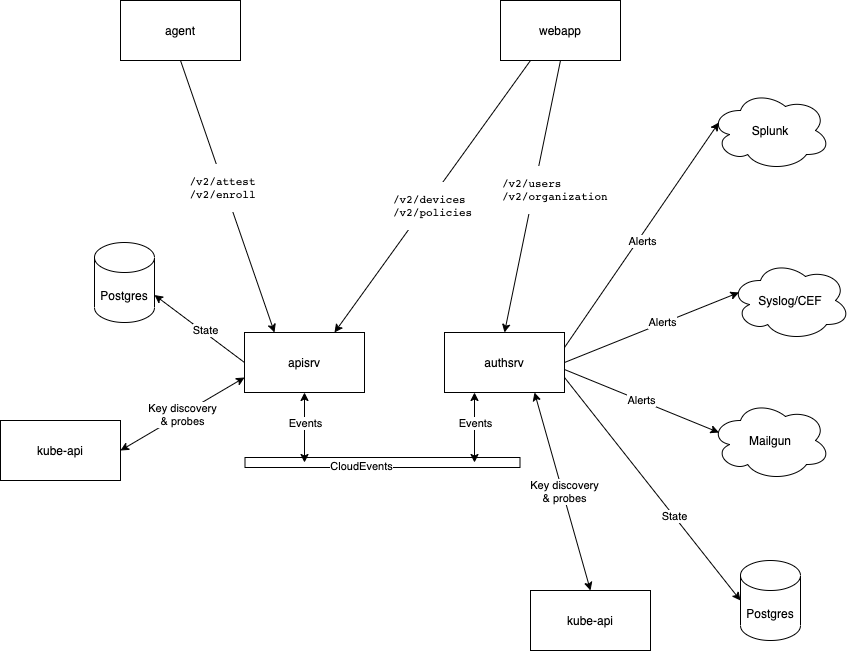
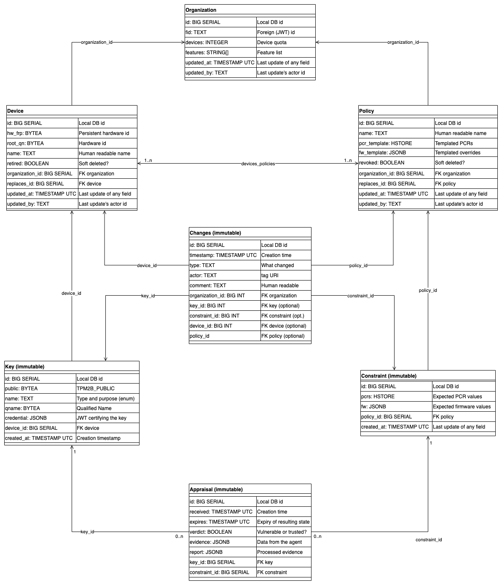
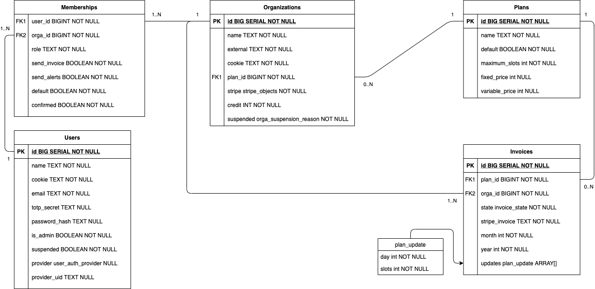

immune Guard Documentation
==========================

[Whitepaper](./whitepaper)

Architecture
------------




Database
--------

Devices and Policies complex



Users and Organizations complex



Routes
------

Changes to resources are done using the PATCH verb. The payload is "partial
resource" i.e. JSON structure that only containes the fields to be updated. As
this the PATCH works the same as a PUT but frees the client from knowing all
values of a resources. The core benefit is that resource updates are
idempotent.

In order to make resource creation calls using POST idempotent the client
supplies a cookie value with the request. The cookie is a random, client
generated value that is used on the server side to decide if the resource has
already been created (returns 200) or needs to be created (returns 201).
Clients can repeat the same POST request with the same cookie value until it
succeeds without needing to worrying about side effects. The cookie value is
required because equal resources are not necessarly identical (e.g. Devices
and Policies).

### apisrv

Handles Devices and Policies, issues Appraisals.

Use case        | Routes                         | Payload           | Result              | Idempotency
---             | ---                            | ---               | ---                 | ---
Ping            | GET /v2/info                   | -                 | Info                | agent, webapp | GET
Enroll-Device   | POST /v2/enroll                | Enrollment        | EncryptedCredential | Device.cookie
Attest-Device   | POST /v2/attest                | Evidence          | -                   | Evidence.cookie
Accept-Changes  | POST /v2/policies              | Policy            | Policy              | Policy.cookie
Schedule-Update | POST /v2/policies              | Policy            | Policy              | Overwrites existing template policy
Abort-Update    | DELETE /v2/policies/:id        | -                 | Policy              | DELETE
Rename-Device   | PATCH /v2/devices/:id         | Policy.name       | Policy              | PATCH
Assign-Tag      | PATCH /v2/devices/:id         | Policy.attributes | Policy              | PATCH
Retire-Device   | PATCH /v2/devices/:id         | Policy.state      | Policy              | PATCH
Resurect-Device | POST /v2/devices/:id/resurect | -                 | Policy              | Same as PATCH state
Fetch-Devices   | GET /v2/devices/:id            | -                 | Device              | GET
Fetch-Devices   | GET /v2/devices?iterator=i     | -                 | Device              | GET
Fetch-Policies  | GET /v2/policies/:id           | -                 | Policy              | GET
Fetch-Policies  | GET /v2/policies?iterator=i    | -                 | Policy              | GET

### authsrv

Handles Users, Organizations and Memberships. Sends alerts.

Use case          | Routes                                 | Payload                  | Result       | Idempotency
---               | ---                                    | ---                      | ---          | ---
Register-User     | POST /v2/users                         | User                     | User         | User.email
Login-User        | POST /v2/session                       | Login                    | User         | Overwrites existing session
Logout-User       | DELETE /v2/session                     | -                        | -            | DELETE
Invite-User       | POST /v2/organizations/:id/invite      | User                     | User         | User.email
Create-Orga       | POST /v2/organizations                 | Organization             | Organization | Organization.name
Orga-Available    | GET /v2/organizations?name=name        | -                        | Organization | GET
Delete-Orga       | PATCH /v2/organizations/:id            | Organization.state       | Organization | PATCH
Undelete-Orga     | PATCH /v2/organizations/:id            | Organization.state       | Organization | PATCH
Config-Splunk     | PATCH /v2/organizations/:id            | Organization.splunk      | Organization | PATCH
Config-Syslog     | PATCH /v2/organizations/:id            | Organization.syslog      | Organization | PATCH
Setup-2FA         | PATCH /v2/users/:id                    | User.google2fa           | User         | PATCH
Change-Password   | PATCH /v2/users/:id                    | User.password            | User         | PATCH
Delete-Account    | PATCH /v2/users/:id                    | User.state               | User         | PATCH
Config-Email      | PATCH /v2/memberships/:org/:user       | Membership.notifications | Membership   | PATCH
Unsubscribe-Email | POST /v2/users/:id/unsubscribe?token=t | -                        | User         | Same as PATCH /v2/users/:id
Change-Role       | PATCH /v2/memberships/:org/:user       | Membership.role          | Membership   | PATCH
Remove-Member     | DELETE /v2/memberships/:org/:user      | -                        | -            | DELETE
Add-Member        | PUT /v2/memberships/:org/:user         | Membership               | Membership   | PUT
Generate-Invoice  | ???                                    | ???                      | ???          | ???

### Each service

All services (apisrv and authsrv) implement Kubernetes probes and CloudEvents endpoints.

Use case    | Routes          | Payload    | Result | Idempotency
---         | ---             | ---        | ---    | ---
Readiness   | GET /v2/ready   | -          | -      | GET
Healthiness | GET /v2/healthy | -          | -      | GET
Recv-Event  | POST /v2/events | CloudEvent | -      | Events have unique ids

Data structures
---------------

Aside from the mutable data structures below we also have immutable ones
described only in the [JSON schema files](../_schemas).

### Device

```typescript
type Device = {
  // writable
  name: string
  attributes: Map<string, string | undefined>

  // can only PATCH'd to "retired"
  state: "new" | "unseen" | "vulnerable" | "trusted" | "outdated" | "retired"

  // read only
  id: string
  fpr: string
  cookie: string

  replaces: string | undefined
  replaced_by: string | undefined

  state_timestamp: string

  last_update_timestamp: string
  last_update_actor: string

  appraisals: Appraisal[]
}
```

**States**

State      | Invariant
---        | ---
new        | device.Get(id) != nil
unseen     | device.Get(id).Keys > 0
trusted    | device.Get(id).AIKs > 0 
           | device.Get(id).Appraisals[-1].Verdict == true
           | device.Get(id).Appraisals[-1].Expires.After(now)
vulnerable | device.Get(id).AIKs > 0 
           | device.Get(id).Appraisals[-1].Verdict == false
           | device.Get(id).Appraisals[-1].Expires.After(now)
outdated   | device.Get(id).Appraisals[-1].Expires.Before(now)
retired    | device.Get(id).Retired == true

**Model**

```
Names LWW<Device, String>
Attributes LWW<Device, map[string]string>
Keys GrowSet<Pair<Device, Key>>
Devices GrowSet<Device>

DevicesPolicies 2PSet<Pair<Device,Policy>>

RetiredDevices GrowSet<Device>
RetiredPolicies GrowSet<Policy>
```

State              | Operation        | Next state            | Side effects
---                | ---              | ---                   | ---
 -                 | Register         | new                   | -
new                | Enroll           | unseen                | -
not new or retired | Attest           | vulnerable or trusted | NewAppraisal event
not new or retired | Garbage-Collect  | outdated              | AppraisalExpired event
not retired        | Retire           | retired               | -
all                | Rename           | same                  | -
all                | ChangeAttributes | same                  | -


Enroll(hwid, fpr, nameHint):

id <- NewUUID()
fields = NewDevice(hwid, fpr)
Devices.Add(
// oldDevs = GetDevicesByFpr(fpr)
// dev = NewDevice(fpr, name_hint)
// for d in oldDevs
//   ReplaceDevice(d, dev)
//   for p in d.Policies
//     RevokePolicyIfUsed(p)
// return dev
type EnrollDevice = (fpr: string, keys: Key[], name_hint: string) => Error_ | undefined
// dev = RegisterDevice(fpr, name_hint)
// for k in keys:
//   NewKey(k, dev)
// NewTemplatePolicy(dev)

### Policy

```typescript
type Policy = {
  // writable
  name: string
  devices: string[]

  valid_since: string | undefined
  valid_until: string | undefined

  // writable once
  pcr_template: Map<string, string> | undefined // PCR -> (sha256 | "")
  cookie: string

  pcrs: Map<string, string> | undefined // PCR -> sha256
  fw_overrides: string[] | undefined // Annotation::id

  // read only
  id: string
  revoked: boolean
}
```

**States**

 - templated: no associated Constraint row in database
 - active: at least one Constraint
 - revoked: revoked field is true
 - inactive: at least on Constraint but outside of valid\_until/valid\_since
 
State       | Operation                                | Next state | Side effects
---         | ---                                      | ---        | ---
 -          | Schedule-Update                          | templated  | -
 -          | Accept-Changes                           | templated  | -
templated   | Attest-Device                            | active     | -
active      | Schedule-Update                          | inactive   | -
active      | Accept-Changes                           | inactive   | -
active      | *now < valid_since OR now > valid_until* | inactive   | -
not revoked | Revoke-Policy                            | revoked    | -

### User

```typescript
type User = {
  // writable
  name: string
  email: string // cookie
  organizations: Membership[]
  twofa: boolean
  admin: boolean

  // write only
  password: string | undefined

  // read only
  id: string
  state: "invited" | "active" | "suspended" | "deleted"
}
```

**States**

 - invited: all Membership are in the invited state
 - active: at least on Membership is active
 - suspended
 - deleted: UI returns 404

 State                   | Operation         | Next state        | Side effects
 --                      | --                | --                | --
 -                       | Register-User     | invited           | -
invited                  | Confirm-Invite    | active            | -
 *                       | Setup-2FA         | *                 | -
 *                       | Change-Password   | *                 | -
not deleted              | Delete-Account    | deleted           | -
not deleted or suspended | Suspend-Account   | suspended         | -
suspended                | Resume-Account    | active or invited | -
 *                       | Config-Email      | *                 | -
 *                       | Unsubscribe-Email | *                 | -

### Organization

```typescript
type Organization = {
  // writable
  name: string // cookie
  users: Membership[]

  // splunk: ???
  // syslog: ???
  plan: Plan
  state: "active" | "suspended" | "deleted"

  // writable once
  cookie: string

  // read only
  id: string
}
```

**States**

 - active
 - suspended
 - deleted

State | Operation | Next state | Side effects
-- | -- | -- | --
 - | Create-Orga | active | QuotaUpdate event
no deleted | Delete-Orga | deleted | QuotaUpdate event
* | Config-Splunk | * | -
* | Config-Syslog | * | -
active | Update-Plan | active | QuotaUpdate event
active | Suspend-Orga | suspended | QuotaUpdate event
suspended | Resume-Orga | active | QuotaUpdate event

### Membership

**States**

 - invited
 - active
 - deleted

```typescript
type Membership = {
  // writable 
  role: "owner" | "user"
  notifications: string[] // "alerts", "invoices"

  // can be PATCH'd between active <-> deleted and invited -> deleted
  state: "invited" | "active" | "deleted"

  // writable once
  user: string
  org: string
  // unique id: (user, org)
  default: boolean // only one default membership per user
}
```
